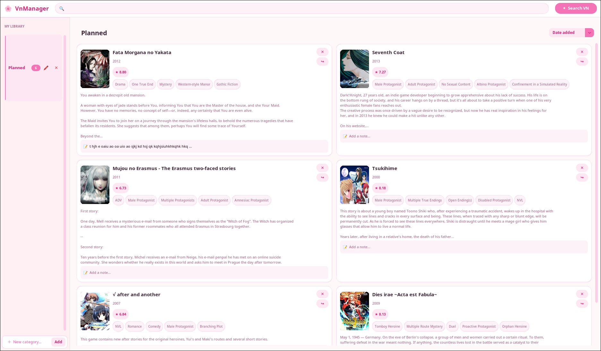
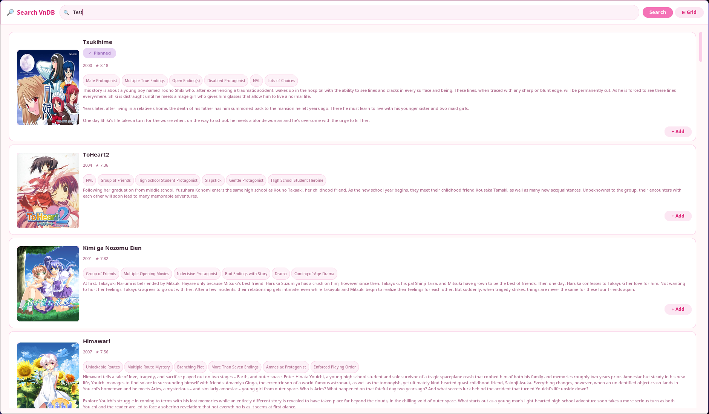
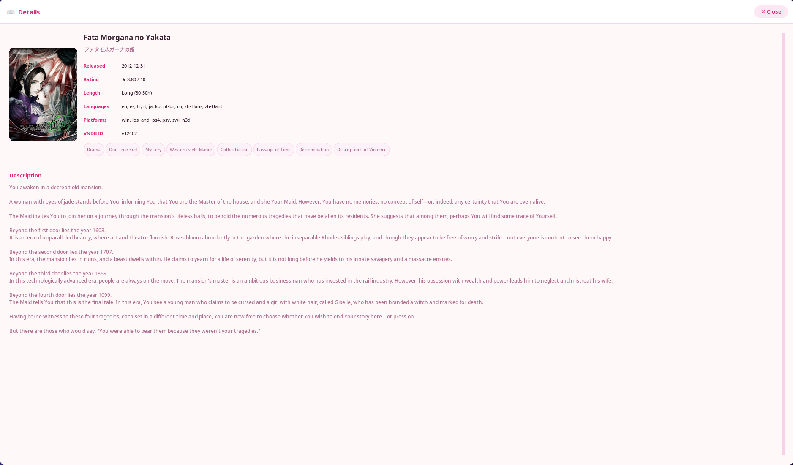

# 🌸 VnManager

A cute little desktop app for tracking your visual novel backlog, built because spreadsheets are not kawaii enough ✨

Pulls everything straight from [VNDB](https://vndb.org) be it covers, ratings, tags, descriptions, release info, all that in a pink fluffy UI you'll actually enjoy looking at (I hope).

  

---

## Screenshots

**Library**


**Searching VnDB**


**VN details**


---

## Features

- Search the VNDB database by title, browse up to 50 results
- Add VNs to custom categories (defaults: Not finished, Finished, Planned)
- Covers, ratings, tags, and descriptions displayed at a glance
- Click any cover or title to open a full detail popup
- Leave personal notes on any VN in your library
- Move VNs between categories easily
- Rename and delete categories whenever you feel like reorganising
- Filter VNs within a category using the top search bar
- Sort by date added, title, rating, release date, or length
- NSFW content toggle in search (suggestive and explicit separately)
- Touchpad scroll support on Linux
- Everything saves locally: no account, no cloud

---

## Requirements

- Python : Only tested with Python 3.14.3 but should work with 3.10 or newer
- On Linux: `tk` package (`sudo pacman -S tk` or `sudo apt install python3-tk`)

---
## How to install

### Windows
Download the latest `VnManager.exe` from the [releases page](https://github.com/Rukeh/VnManager/releases).

### Arch Linux (AUR)
```bash
yay -S vnmanager
```

### From source
```bash
git clone https://github.com/Rukeh/VnManager.git
cd VnManager
pip install -r requirements.txt
python main.py
```
> **You will probably need to create a virtual environment.**

> **For information: For source** As the project is still in early build, its not a recommended way to download it, but its all there is for now for other distros.

> **Linux/Wayland:** If the window doesn't open, try `GDK_BACKEND=x11 python main.py`

---

## 🗒️ Notes

Personal project made out of frustration with having nowhere cute to track VNs. Not trying to replace your VNDB lists just a nice local companion for your backlog.

If something breaks or you have an idea, feel free to open an issue ♡

---

## 📄 License

MIT — see [LICENSE](LICENSE)
